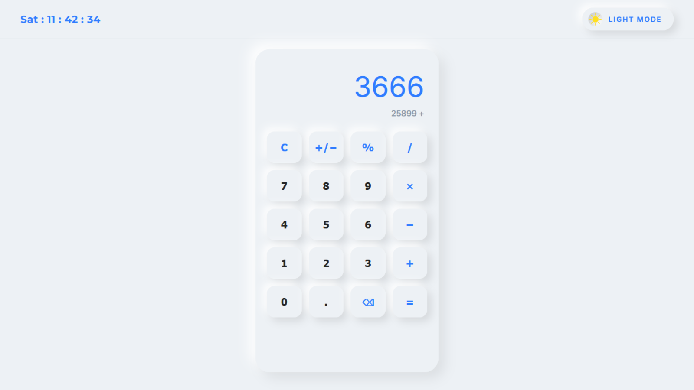

<h1 align="center">Smart Neumorphic Calculator</h1>

<p align="center">
  A modern neumorphic calculator with <b>Light/Dark mode</b> and a <b>real-time clock</b>.<br/>
  Built using <b>HTML, CSS, and Vanilla JavaScript</b>.
</p>

<p align="center">
  
  
  
</p>

---

## ✨ Preview

<p align="center">
  
</p>

---

## 🚀 Features

- ✅ Neumorphic UI design
- ✅ Light / Dark mode toggle
- ✅ Real-time clock in the header
- ✅ Responsive layout
- ✅ Smooth UI transitions
- ✅ Keyboard support for faster calculation

---

## ⌨️ Keyboard Shortcuts

| Key              | Action           |
| ---------------- | ---------------- |
| `0-9`            | Enter numbers    |
| `.`              | Decimal          |
| `+ - * /`        | Operators        |
| `Enter` or `=`   | Calculate        |
| `Backspace`      | Delete one digit |
| `Delete` / `Esc` | Clear all        |

---

## 🧠 JavaScript Learnings

While building this project, I learned and implemented:

- DOM Manipulation using `querySelector()` and `textContent`
- Event Handling:
  - `click` event using **event delegation**
  - `keydown` event for full keyboard support
- `dataset` usage (`data-value`, `data-action`) to detect button actions
- State based calculator logic using:
  - `firstValue`, `secondValue`, `operator`
  - `shouldResetDisplay` for clean next-input behavior
- Reusable calculation function with `switch-case`
- Edge-case handling:
  - Preventing multiple decimals
  - Division by zero handling (`error`)
  - Toggle sign (`+/-`) including `-0`

---

## 🛠 Tech Stack

- HTML5
- CSS3
- JavaScript (Vanilla)

---

## 📂 Project Structure

```bash
smart-neumorphic-calculator/
│
├── index.html
├── README.md
│
├── assets/
│   └── preview.png
│
├── css/
│   └── app.css
│
└── js/
    ├── app.js
    └── header-controls.js

🌍 Live Demo

👉 https://taffuwebx09.github.io/smart-neumorphic-calculator/

👨‍💻 Author

Tafajjul
```
